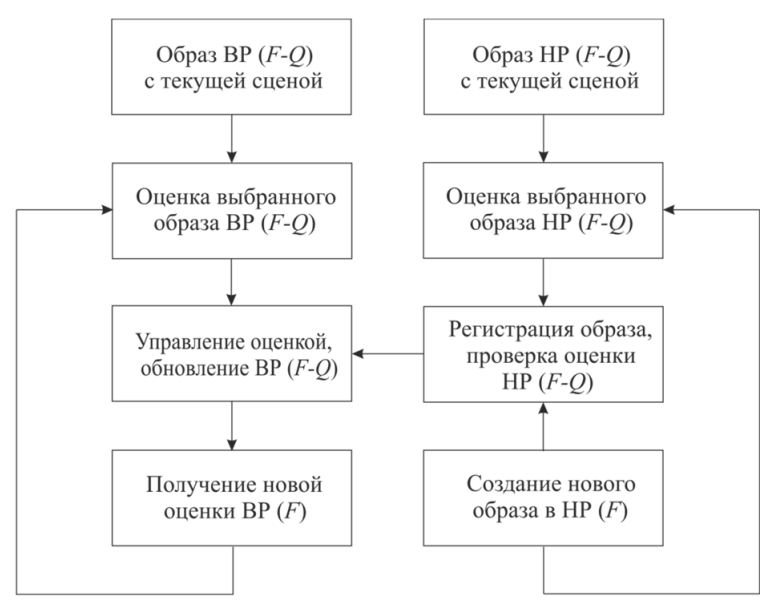
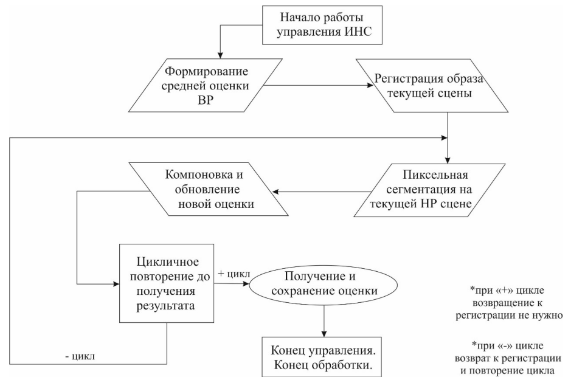
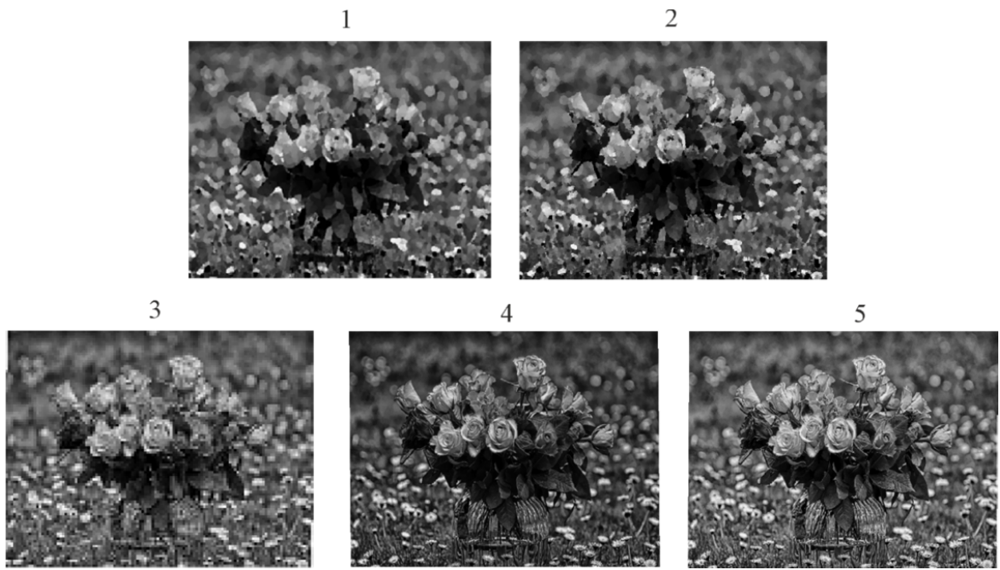

= Управление искусственных нейронных сетей распознавания раскадровки образов высокого разрешения
:showtitle:
:page-navtitle: Статья по нейронным сетям на AsciiDoc
:page-excerpt: Excerpt goes here.
:page-root: ../../../

[NOTE]
На данной странице демонстрируется оформление статьи с помощью AsciiDoc.

.*Аннотация (RU)*
[%collapsible]
====
* _Актуальность и цели_. Раскрывается задача анализа распознавания и управления образов высокой четкости с минимальной погрешностью благодаря предшествующему покадровому распознаванию комплекса изображений низкой четкости. Фундаментальной проблемой является появление и воздействие градиентных помех в виде разукрупненных пиксельных сегментов, в значительной мере снижающих разрешение рассматриваемой области.

* _Материалы и методы_. До настоящего времени данное направление исследований искусственных нейронных сетей не было достаточно изучено в связи с низким потребительским спросом технологии и медленным развитием от энтузиастов. Несмотря на тот факт, что распознавание изображений не являлось перспективным направлением ранее, на данный момент оно таит в себе потенциал в области применения искусственных нейронных сетей и нивелирования градиентных помех с глубоким обучением на их основе.

* _Результаты и выводы_. Рассматривается как возможность адаптации старых существующих подходов к решению задачи анализа и распознавания образов, так и предложен новый метод управления на основе комплекса раскадровки искусственных нейронных сетей с дальнейшим объединением для глубокого обучения и решения поставленных задач.
====

.*Аннотация (En)*
[%collapsible]
====
* _Background_. Scientific article reveals the problem of analyzing, recognizing and managing high definition images with a minimum error due to the previous frame-by-frame recognition of a complex of low definition images. The fundamental problem is the appearance and impact of gradient noise in the form of disaggregated pixel segments, which significantly reduce the resolution of the area under consideration.

* _Materials and methods_. Until now, this area of research on artificial neural networks has not been sufficiently studied due to low consumer demand for the technology and slow development from enthusiasts. Despite the fact that image recognition was not
a promising direction before, at the moment it holds potential in the field of application of artificial neural networks and gradient noise leveling with deep learning based on them.

* _Results and conclusions_. The article considers both the possibility of adapting old existing approaches to solving the problem of pattern analysis and recognition, and a new control method based on a complex of storyboarding artificial neural networks with further integration for deep learning and solving problems.
====

*Ключевые слова*: образ, искусственная нейронная сеть, глубокое обучение, градиентные помехи, раскадровка

*Keywords*: image, artificial neural network, deep learning, gradient noise, mapping

== Введение

Качество цифровых образов является комплексным собирательным понятием, зависящим как от ограничений передаточных систем и каналов связей, так и характеристик сред формирования и обработки. Для образов качественным параметром является высокое разрешение (ВР), соответствующее поставленным для конкретных целей задачам и отвечающее требуемому уровню детализации и обрисовки сцен. В связи с ограничениями некоторых сред формирования и обработки образов на аппаратном уровне не представляется возможным получение изображений ВР без дополнительной
постобработки [1]. Для таких сред с формированием образов в низком разрешении (НР) следует
применить распознавание на основе алгоритмической раскадровки, улучшающей и адаптирующей
качество образов и четкость детализации благодаря покадровой обработке сцен образов. Алгоритмы раскадровки позволяют получить искомые образы ВР путем заполнения комплекса изображений НР одного и того же кадра и их осевого смещения пикселей в конкретных сценах.

Одним из негативных факторов прямого воздействия на выходное качество образов является появление градиентных помех и их влияние на распределение разукрупненных пикселей. Фрагментарное разукрупнение образов формируют области пиксельных перекрытий, снижающих итоговое качество. Такие области не могут быть устранены путем образной фильтрации, и многие современные алгоритмы фундаментально не приспособлены к их нивелированию [2]. Итерационные алгоритмы линейной и нелинейной фильтрации способны решить данную проблему, однако зачастую не оправданы практически в связи с рядом допущений при построении математических моделей.

Задача управлением постобработки образов требует более адаптивной динамики подходов, которыми могут выступать методы глубокого обучения посредством специальной архитектуры искусственных нейронных сетей – сверточных нейронных сетей и их вариаций в зависимости от сложности решения текущей проблемы. Глубокое обучение и сверточные нейронные сети могут применяться для управления решением покадровых задач постобработки благодаря отсутствию необходимости построения математических моделей, но при этом накладываются ограничения, типичные для процесса обучения, в виде большого объема обучающих выборок, большого объема
данных анализируемых примеров образов и времени на обработку и обучение.

Научной новизной представленного в работе метода является адаптация преимуществ глубокого обучения сверточных нейронных сетей и сегментации градиентных помех в предобработке образов НР в конкретном комплексе задач посредством алгоритмической раскадровки.

=== Управление постобработкой образов

Для решения поставленной в работе задачи управления качеством образов в частных случаях применяется адаптивный подход с уточнением оценок комплексов сцен. Условимся, что имеется \(N\)-образов НР \(F^Q\) подряда (\(d^L\), \(w^L\), \(c\)), которые подвергаются воздействию градиентных помех и фрагментарному разукрупнению пикселей [3]. Задачей поставим получение изображения ВР (\(F^H\)) с качеством выше исходного без воздействия градиентных помех.

Частным решением поставленной задачи будет являться подход с применением алгоритмического оценочного комплекса. Помимо текущей задачи сегментации градиентных помех на схеме итеративной постобработки значительным преимуществом также является оценка образа и ее точность, на основании которой определяется качество осевого смещения пикселей между образами одной сцены. Воздействие градиентных помех напрямую влияет на оценочный показатель, поскольку попиксельно снижает качество выбранной области. Подход с применением оценочных уточнений учитывает возможные недочеты при регистрации образов в НР и при обновлении их оценки формирует обновление оценки образа ВР. Схема постобработки образов с оценочной системой (рис. 1) состоит из трех последовательных итераций:

. оценка осевого смещения пикселей соседствующих последовательных образов одной сцены и регистрация текущего образа;
. управление полученной оценки образа в ВР для ее обновления;
. обновление оценочного цикла до получения искомого результата.

123

image::/images/1-nn-ru-ovsm.png[align="center"]

123

123

123

image::../../..images/1-nn-ru-ovsm.png[align="center"]

123

include::../images/include-variety-for-images.adoc[tag=second-entry-1]

[.text-center]
Рис. 1. Схема итерации постобработки образов с оценочной системой

Главным преимуществом представленной схемы постобработки образов является управление
точностью оценки образа ВР благодаря осевому смещению пикселей образов одной сцены НР. Полученная в ходе каждой итерации оценки образов НР информация способствует нивелированию негативного влияния градиентных помех. Особенностью схемы является одновременное нивелирование градиентных помех вместе с повышением разрешения образов НР и ВР соответственно. Последовательность обработки образов НР не является фиксированной и имеет свободную длину с
одинарной обработкой текущей сцены.

В связи с приближенной точностью оценочных подходов, не гарантированно ссылающихся на точные предположения о статистических свойствах исходных образов, возможно образование «некорректных оценок».

Отсутствие строгих баз правил формирования длин обработки выбранных сцен влияет не только на итоговый результат, но и на затрачиваемое на каждую итерацию обработки сцен время.

=== Обработка образов с применением искусственных нейронных сетей

Для решения задачи повышения качества образов и нивелирования негативного влияния градиентных помех лучшим выбором будут искусственные нейронные сети (ИНС). ИНС и управление на их основе не нуждаются в моделях данных и отличаются исключительным быстродействием при уже обученной структуре.

Подход с применением ИНС, со сверточными нейронными сетями в частности, для регистрирования образов и повышения/восстановления их разрешения уже был практически реализован в алгоритме FVRSR [4]. Регистрация образов НР фиксировалась посредством сверточной нейронной сети LiteFlowNet2, разработанной на основе CVPR LiteFlowNet и имеющей с решенной проблемой оценки оптического потока, мешающей работе над образами в предыдущей версии [5]. Применение
LifeFlowNet2 позволит в дальнейшем повысить точность оценок НР и улучшит итоговую детализацию отображений сцены. В качестве программной библиотеки для глубокого обучения LiteFlowNet2 используем TensorFlow.

Управление сверточной нейронной сетью осуществляется посредством обработки приема двух образов разного разрешения - оценка ВР и образ в НР с повышенной четкостью посредством осевого смещения пикселей и раскадровки. Итоговым результатом их слияния будет один образ с обновленной оценкой по аналогичной схеме (рис. 1).

После проведения ряда исследовательских работ удалось получить результат в виде частичного нивелирования градиентных помех, однако такой подход не решает проблему воздействия помех, изначально воздействующих на образ-первоисточник. Воздействие на первоисточник приведет к появлению пиксельных искажений даже после прохождения через постобработку с оценочной системы. Более того, такой подход не даст результатов в области глубокого обучения нейронной сети, предлагая фундаментально некорректные области распознавания и неверно их адаптируя. Для гипотетического улучшения схемы постобработки образов (рис. 1) добавим в алгоритм работы расчет средней оценки-первоисточника с последовательной обработкой и обособленной пиксельной сегментацией.

Внедрение сверточной нейронной сети для раскадровки со средней оценкой-первоисточником и последовательной обработкой можно адаптировать созданные ранее подходы с классической оценочной системой без применения ИНС. Внедрение ИНС позволит реализовать управление предварительно обученными нейронными сетями по принципу DAG-сети, позволяющей планомерно компоновать
комплексную раскадровку образов для получения новой, отличной от текущих оценку ВР [6].

Описательная часть работы новой схемы с управлением ИНС заключается в следующих последовательных этапах:

[.text-center]
Рис. 2. Схема постобработки образов с управлением ИНС

. начало работы управления ИНС;
.формирование средней оценки первоисточника ВР на основе НР-образов-первоисточников текущей сцены;
. регистрация образа текущей сцены;
. пиксельная сегментация областей, пострадавших от воздействия градиентных помех на текущей НР-сцене;
. компоновка и обновления новой оценки на основе данных о пиксельной сегментации областей с градиентными помехами и текущей оценки сцены образа НР;
. цикличное повторение пунктов № 2–4 до получения удовлетворительного результата в виде комплекса раскадровки образов НР;
. окончание работы цикла при получении последней оценки образа ВР и ее принятие как
итого образа ВР;
. конец управления, завершение работы.

Для новой схемы регистрирование последующих образов НР происходит посредством нейронной сети LiteFlowNet2 и осевого смещения рассматриваемого образа на образ-первоисточник. Каждый слой сверточной нейронной сети для подхода с раскадровкой образов и средней оценкой НР пошагово увеличивает итоговое качество результата, образуя комплекс двух совместно работающих подсетей и решением проблемы градиентных помех и пиксельных искажений.

=== Обучение ИНС и раскадровка образов

Обучение ИНС и сверточной нейронной сети, в частности, придерживается принципа оптимального глубокого обучения – отсутствие лишних обучающих выборок, отсутствие необходимости в переобучении и избегание ошибочного обучения. Обучение сверточной нейронной сети будет происходить методом стохастического градиентного спуска с выборкой из 50 изображений НР одной сцены с разным процентным градиентным повреждением четкости [7]. Для защиты от переобучения применим подход «исключение» с методом выбрасывания случайных одиночных нейронов – дропаут. Поскольку в основе работы сверточной нейронной сети лежат полносвязные слои, требуется объединение сцен образов в обучающий набор.

Тогда обучающий набор для сверточной нейронной сети с набором \n\ образов \(l\)-подряда будет вычисляться по формуле

[.text-center]
\[
f\left(\frac{h^i=l}{z_{ji}}\right) = \frac{e(z_i)l}{\sum_{n=1}^{k} e(z_i)n}
\]

где \(n\) – текущий набор образов текущей сцены; \(h(i)\) – первая половина обучающего набора в НР с \(i\) положительным фрагментом сцены; \(l\) – подряд текущего набора образов; \(z^i\)
– вторая половина обучающего набора в НР с \(i\)-м отрицательным фрагментом сцены.

В связи с количественным преобладанием степеней свободы в сверточных нейронных сетях они склонны к незначительной погрешности в выходных данных, допустимых для нашего исследования и не усугубляющих ВР с точки зрения ухудшения качества градиентными помехами. На рис. 3 наглядно демонстрируется практический результат работы в LiteFlowNet2. Результаты изображений 2 и 3 соответствуют подходу приведенному на рис. 1, схеме постобработки без применения ИНС и глубокого обучения. Изображение 4 минимально подвержено градиентным помехам и показывает наиболее близкий к оригиналу результат и соответствует уровню четкости образа в ВР:

[.text-center]
Рис. 3. Результаты работы управлением раскадровкой в LiteFlowNet2:

. образ-первоисточник в НР;

. образ с оценочной системой (см. рис. 1);

. образ с частичным нивелированием градиентных помех;

. образ по новой схеме постобработки с управлением ИНС;

. 5 – оригинал изображения в ВР

=== Заключение

Таким образом, представленный в работе новый подход к постобработке образов с применением ИНС и глубокого обучения показывает более качественный результат в области нивелирования градиентных помех и получения выходных образов ВР, чем предшествующий вариант без применения сверточных нейронных сетей и обучения. В дальнейшем точность применяемого подхода может быть увеличена за счет новой версии среды обучения LiteFlowNet3 при ее окончательной отладке и готовности к массовому использованию.

.Список литературы
[%collapsible]
====
. Kawano M., Mikami K., Yokoyama S. [et al]. Road marking blur detection with drive recorder // International Conference on Big Data. 2017. P. 4092–4097.

. Astafyev A., Gerashchenko S., Yurkov N. [et al.]. Neural Network System for Medical Data Approximation // Information Technology in Medical Diagnostics III – Metrological Aspects of Biomedical Research. 2021. P. 81–90.

. Krizhevsky A, Sutskever I, Hinton G. E. ImageNet classification with deep convolutional neural networks // Commun ACM. 2017. Vol. 60. P. 84–90. doi:10.1145/3065386.

. Molini A. B., Valsesia D., Fracastoro G., Magli E. DeepSUM: Deep neural network for super-resolution of unregistered multitemporal images // IEEE Trans Geosci Remote Sens. 2020. Vol. 58. P. 3644–3656.
doi:10.1109/TGRS.2019.2959248.

. Дивеев А. И., Полтавский А. В., Алхатем А. Нейро-нечеткое управление процессом сушки пиломатериалов // Надежность и качество сложных систем. 2021. № 3. С. 93–97.

. Алхатем А. Нейро-нечеткое регулирование кондиционированием офисных зданий с учетом показателя временной комфортности // Труды Международного симпозиума Надежность и качество. 2021. Т. 1. С. 144–146.

. Grigoriev A. V., Kochegarov I. I., Yurkov N. K. [et al.]. Research on the possibility to apply vibration blurring of a round mark image in technical condition monitoring of moving mechanisms // Procedia Computer Science. 14th International Symposium "Intelligent Systems", INTELS 2020". 2021. P. 736–742.
====