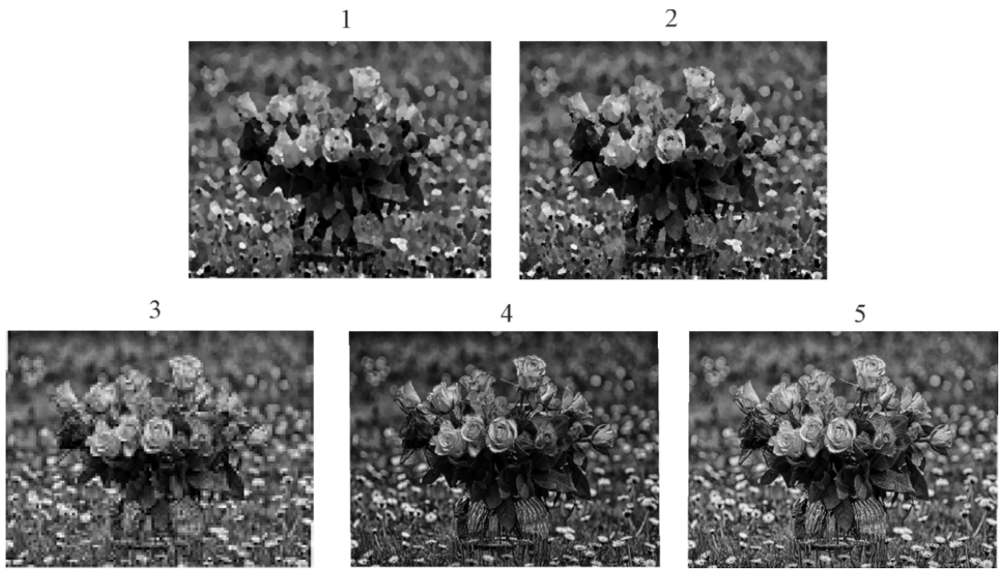

= Include file for images
//Лучше использовать теги, чем номера строк для include

.2024-05-50-second-entry.adoc
[%collapsible]
====
// tag::second-entry-1[]

// end::second-entry-1[]

// tag::second-entry-2[]

// end::second-entry-2[]

// tag::second-entry-3[]

// end::second-entry-3[]
====